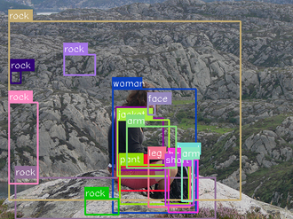
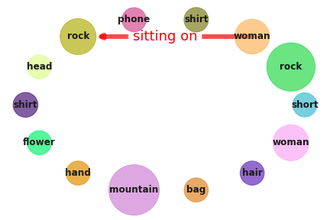

# Scene Graph Generation

| Object Detections |  Ground truth Scene Graph |  Generated Scene Graph
|:-------------------------:|:-------------------------:|:-------------------------:|
| <figure> </figure> |  <figure> <figcaption></figcaption></figure> | <figure> <figcaption></figcaption></figure> |

In this visualization, `woman sitting on rock` is a **zero-shot** triplet, which means that the combination of `woman`, `sitting on` and `rock` has never been observed during training. However, each of the object and predicate has been observed, but together with other objects and predicate. For example, `woman sitting on chair` has been observed and is not a zero-shot triplet. Making correct predictions for zero-shots is very challenging, so in our paper we address this problem and improve zero-shot as well as few-shot results.


This code accompanies our paper [Boris Knyazev, Harm de Vries, Cătălina Cangea, Graham W. Taylor, Aaron Courville, Eugene Belilovsky. "Graph Density-Aware Losses for Novel Compositions in Scene Graph Generation"](https://arxiv.org/search/cs?searchtype=author&query=Knyazev%2C+B)


To run our experiments we used amazing [Rowan Zellers' code for Neural Motifs](https://github.com/rowanz/neural-motifs). Its only problem is the difficult to be run in PyTorch > 0.3, making it hard to use it on some recent GPUs.

So, in this repo, I provide a cleaned-up version that can be run in PyTorch 1.2 or later. The code is based on Mask R-CNN built-in in recent PyTorch.
It should be possible to reproduce our GQA results using this code.

**This code does not require building or manually downloading anything in advance**. Training the Scene Graph Classification (SGCls) model with our loss on Visual Genome is as easy as running this command:

`python main.py -data data_path -loss dnorm`

The script will automatically download all data and create the following directories (make sure you have at least 30GB of disk space in `data_path`):

```
data_path
│   VG
│   │   VG.tar
│   │   VG_100K (this will appear after extracting VG.tar)
│   │   ...
│
└───GQA
│   │   GQA_scenegraphs.tar
│   │   sceneGraphs (this will appear after extracting GQA_scenegraphs.tar)
|   |   ...
```

To run it on GQA, use:

`python main.py -data data_path -loss dnorm -split gqa -lr 0.002`

Checkpoints and predictions will be saved locally in `./results`. This can be changed by the `-save_dir` flag. See examples below.

**This repository is still in progress, please report any issues.**

## Requirements

- Python > 3.5
- PyTorch >= 1.2
- Other standard libraries

Should be enough to install these libraries (in addition to PyTorch):
```
conda install -c anaconda h5py cython dill pandas
conda install -c conda-forge pycocotools tqdm
```

Results in this repo were obtained on a single GPU 1080/2080 Ti, up to 11GB of GPU memory and 32GB of RAM was required.

## TODO

- [x] Message Passing with Mask R-CNN
- [x] Automatically download all files required to run the code
- [x] Obtain SGCls/PredCls results on VG and GQA
- [x] Obtain SGGen results on VG and GQA
- [x] Add trained checkpoints 
- [ ] Add SGGen checkpoints after refinement
- [ ] Add the script to visualize scene graph generation using the trained checkpoint on VG and GQA


## VG Results

Results here are obtained using Mask R-CNN with ResNet-50 as a backbone, while in the paper we used Faster R-CNN with VGG16 as a backbone. We also skip a refinement step in this repo, which is usually required to improve SGGen results. Hence there's some difference in results from the paper. See full details in the paper. 

| Loss | Detector |  SGCls-R@100 |  SGCls-R_ZS@100 | PredCls-R@50 | PredCls-R_ZS@50
|:-----|:-----:|:-----:|:-----:|:-----:|:-----:|
| Baseline, this repo | Mask R-CNN (ResNet-50) pretrained on COCO | 47.1 | 7.8 | 74.5 | 23.5 |
| D-norm (ours), this repo<sup>‡</sup> | Mask R-CNN (ResNet-50) pretrained on COCO |47.4 | 9.0 | 75.4 | 27.3
| D-norm (ours), paper | Faster R-CNN (VGG16) pretrained on VG |48.6 | 9.1 | 78.2 | 28.4

<sup>‡</sup> Can be reproduced by running: `python main.py -data data_path -loss dnorm -save_dir VG_sgcls`

Or download our [VG-SGCls-1 checkpoint](https://drive.google.com/file/d/1m-_fvznwDgqhKzMYL15HcZIy2qi38U5X/view?usp=sharing)

### Scene Graph Generation on VG

| Loss | Detector |  SGGen-R@100 |  SGGen-R_ZS@100 | SGGen-mR@100
|:-----|:-----:|:-----:|:-----:|:-----:|
| Baseline, this repo | Mask R-CNN (ResNet-50) pretrained on VG | 26.4 | 1.0 | 6.3
| D-norm (ours), this repo<sup>‡</sup> | Mask R-CNN (ResNet-50) pretrained on VG | 26.5 | 1.4 | 9.5
| D-norm (ours), paper | Mask R-CNN (ResNet-50) pretrained on VG | 28.2 | 1.2 | 9.5

<sup>‡</sup> Steps to reproduce the results above:
1. Fine-tune Mask R-CNN on VG:
`python pretrain_detector.py stanford data_path ./pretrain_VG`  # takes about 1 day

Or download our [VG-detector checkpoint](https://drive.google.com/file/d/1XtlObixHaLokoQx9VX9r4a-Nx5jxR63i/view?usp=sharing)

2. Train SGCls:
`python main.py -data data_path -loss dnorm -ckpt pretrain_VG/gqa_maskrcnn_res50fpn.pth -save_dir VG_sgdet`   # takes about 1 day

Or download our [VG-SGCls-2 checkpoint](https://drive.google.com/file/d/1cE8hOi2YqXgXprY44thlxKujMgtWggHe/view?usp=sharing)
This checkpoint is different from VG-SGCls-1, because here the model is trained on the features of the VG-pretrained detector. This checkpoint can be used in the next step.

3. Evaluate SGGen:
`python main.py -data data_path -ckpt ./VG_sgdet/vgrel.pth -m sgdet -nepoch 0`  # takes a couple hours


## GQA Results

In this repo, I am using a slightly different edge model in [UnionBoxesAndFeats](lib/get_union_boxes.py) to avoid building code and simplify the pipeline. This can contribute to the difference. Using [Neural Motifs's](https://github.com/rowanz/neural-motifs) edge model should lead to more similar results.

| Loss | Detector |  SGCls-R@100 |  SGCls-R_ZS@100 | PredCls-R@50 | PredCls-R_ZS@50
|:-----|:-----:|:-----:|:-----:|:-----:|:-----:|
| Baseline, this repo | Mask R-CNN (ResNet-50) pretrained on COCO | 27.1 | 2.9 | 58.4 | 33.1 |
| D-norm (ours), this repo<sup>‡</sup> | Mask R-CNN (ResNet-50) pretrained on COCO |27.4 | 3.1 | 59.6 | 36.0
| D-norm (ours), paper | Mask R-CNN (ResNet-50) pretrained on COCO | 27.6 | 3.0 | 61.0 | 37.2

<sup>‡</sup> Can be reproduced by running: `python main.py -data data_path -loss dnorm -split gqa -lr 0.002 -save_dir GQA_sgcls`  # takes about 1 day

Or download our [GQA-SGCls-1 checkpoint](https://drive.google.com/file/d/1ktyV7atNRIS0UhiQOoPCR_392FQz6eB6/view?usp=sharing)

### Scene Graph Generation on GQA

| Loss | Detector |  SGGen-R@300 |  SGGen-R_ZS@300 | SGGen-mR@300
|:-----|:-----:|:-----:|:-----:|:-----:|
| Baseline, this repo | Mask R-CNN (ResNet-50) pretrained on GQA | 6.2 | 0.5 | 1.3
| D-norm (ours), this repo<sup>‡</sup> | Mask R-CNN (ResNet-50) pretrained on GQA | 6.3 | 0.7 | 2.4
| D-norm (ours), paper | Mask R-CNN (ResNet-50) pretrained on GQA | 4.6 | 0.4 | 2.0

<sup>‡</sup> Steps to reproduce the results above:

 1. Fine-tune Mask R-CNN on GQA:
`python pretrain_detector.py gqa data_path ./pretrain_GQA`  # takes about 1 day

Or download our [GQA-detector checkpoint](https://drive.google.com/file/d/1VR8uMR0WMbqiA2hPIxq7AzvpNqzzyKfT/view?usp=sharing)

2. Train SGCls:
`python main.py -data data_path -lr 0.002 -split gqa -nosave -loss dnorm -ckpt pretrain_GQA/gqa_maskrcnn_res50fpn.pth -save_dir GQA_sgdet`   # takes about 1 day

Or download our [GQA-SGCls-2 checkpoint](https://drive.google.com/file/d/1wldE-ONCs15balmR1IdZvnD2byZ8dNB7/view?usp=sharing)
This checkpoint is different from SGCls-1, because here the model is trained on the features of the GQA-pretrained detector.
This checkpoint can be used in the next step.

3. Evaluate SGGen:
`python main.py -data data_path -split gqa -ckpt ./GQA_sgdet/vgrel.pth -m sgdet -nosave -nepoch 0`  # takes a couple hours

## Scene Graph Visualizations

## Citation

Please use this bibtex if you want to cite our paper:

```
@inproceedings{knyazev2020graphdensity,
  title={Graph Density-Aware Losses for Novel Compositions in Scene Graph Generation},
  author={Knyazev, Boris and de Vries, Harm and Cangea, Cătălina and Taylor, Graham W and Courville, Aaron and Belilovsky, Eugene},
  booktitle={British Machine Vision Conference (BMVC)},
  pdf={http://arxiv.org/abs/2005.08230},
  year={2020}
}
```
